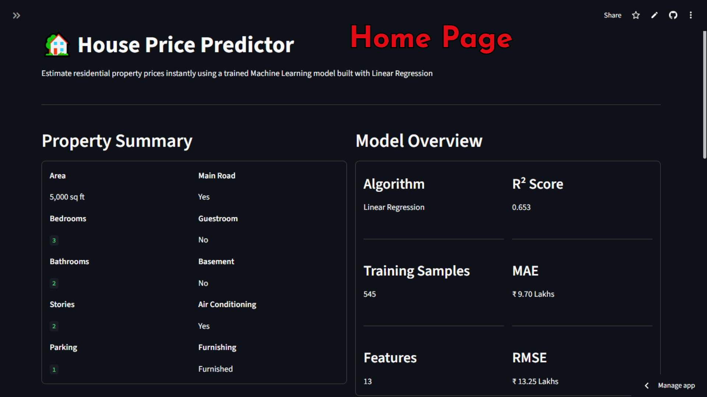
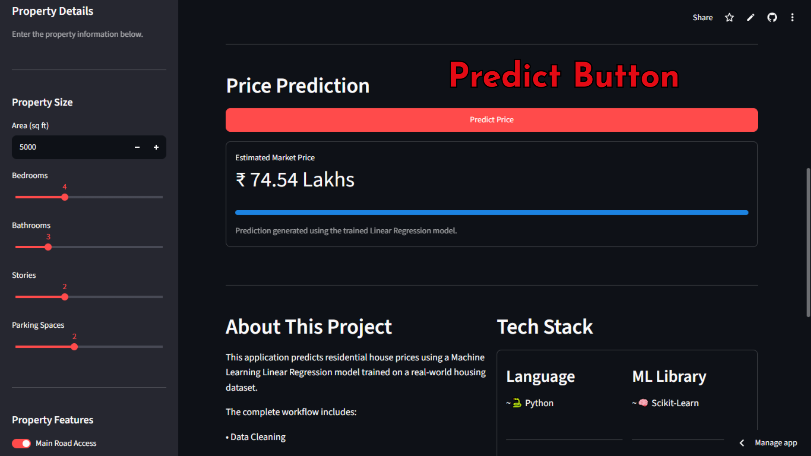
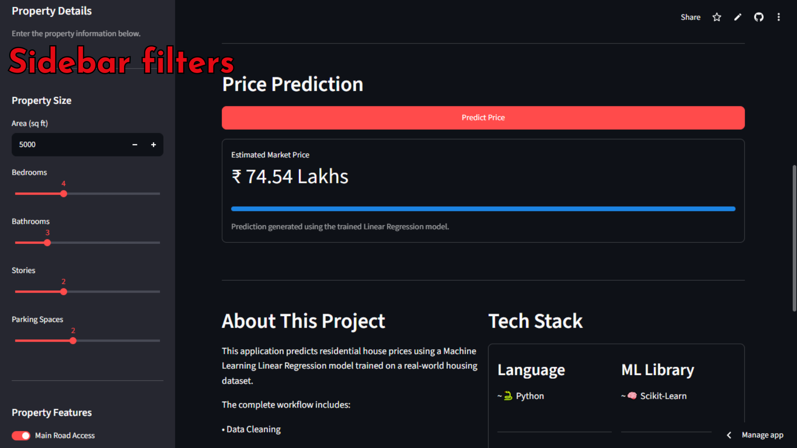
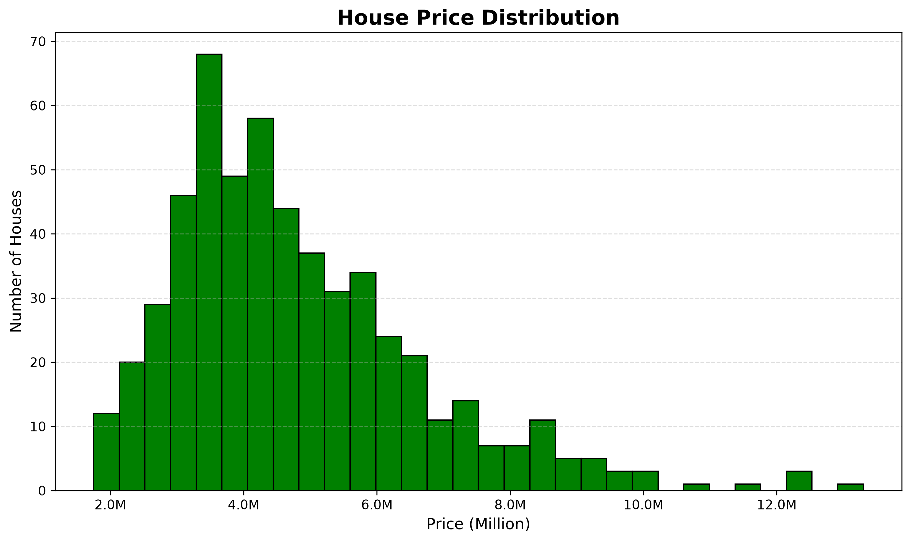
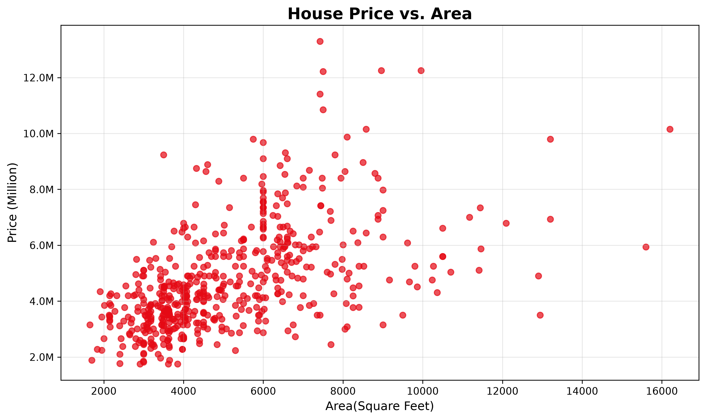
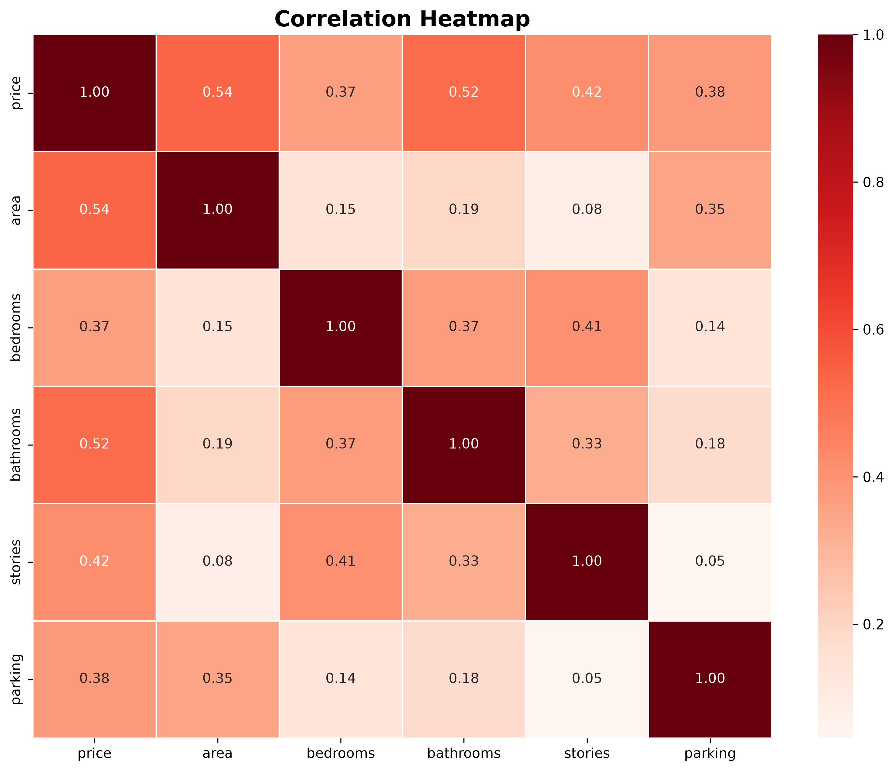
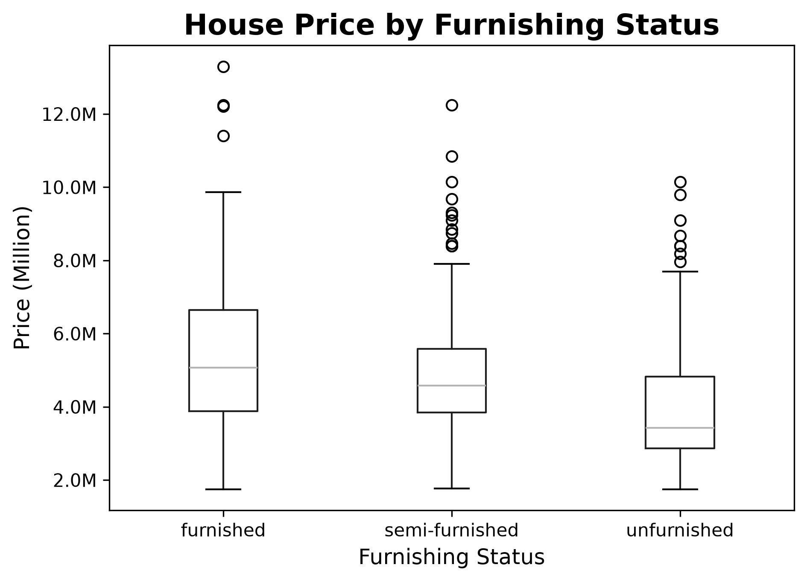

# 🏠 House Price Predictor

<p align="center">
  <strong>Predict residential house prices using Machine Learning and Streamlit.</strong>
  <br><br>
  An end-to-end Machine Learning project covering data analysis, preprocessing, model training, evaluation, and deployment.
</p>

---

## 🚀 Live Demo

👉 **Try the application here:**

**https://predict--house--price.streamlit.app**

---

# 📸 Application Preview

## Home Page



---

## Prediction



---

## Sidebar



---

# 📖 Project Overview

House Price Predictor is an end-to-end Machine Learning application that estimates residential property prices based on key house features.

The project demonstrates the complete ML workflow:

- Data Analysis
- Data Preprocessing
- Feature Engineering
- Machine Learning Model Training
- Model Evaluation
- Interactive Web Application
- Cloud Deployment

The application allows users to adjust house specifications and receive an instant estimated market price.

---

# ✨ Features

- 📊 Exploratory Data Analysis (EDA)
- 🧹 Data Cleaning & Preprocessing
- 🔄 Feature Encoding
- 🤖 Linear Regression Model
- 📈 Real-Time Price Prediction
- 🎛 Interactive Streamlit Dashboard
- 💾 Saved Machine Learning Model using Joblib
- ☁️ Cloud Deployment with Streamlit Community Cloud

---

# 🛠 Tech Stack

| Category | Technology |
|----------|------------|
| Language | Python |
| Data Analysis | Pandas, NumPy |
| Visualization | Matplotlib |
| Machine Learning | Scikit-Learn |
| Model Saving | Joblib |
| Web App | Streamlit |
| Version Control | Git & GitHub |

---

# 📂 Project Structure

```
House-Price-Predictor/

│── app.py
│── analysis.py
│── train_model.py
│── requirements.txt
│── README.md
│── .gitignore

├── data/
│   └── house_prices.csv

├── model/
│   ├── house_price_model.pkl
│   └── model_features.pkl

├── images/
│   └── charts
│       ├── correlation_heatmap.png
│       ├── furnishing_status.png
│       ├── price_distribution.png
│       └── price_vs_area.png

└── screenshots/
    ├── home.png
    ├── prediction.png
    └── sidebar.png
```

---

# 📊 Dataset Information

The dataset contains **545 residential properties** with **13 features**.

### Features

- Area
- Bedrooms
- Bathrooms
- Stories
- Main Road Access
- Guest Room
- Basement
- Hot Water Heating
- Air Conditioning
- Parking
- Preferred Area
- Furnishing Status
- Price (Target)

---

# 🧠 Machine Learning Workflow

```
Dataset

      ↓

Data Cleaning

      ↓

Feature Engineering

      ↓

Train/Test Split

      ↓

Linear Regression

      ↓

Model Evaluation

      ↓

Save Model

      ↓

Streamlit Deployment
```

---

# 📈 Model Performance

| Metric | Value |
|---------|-------|
| Algorithm | Linear Regression |
| Training Samples | 436 |
| Testing Samples | 109 |
| Features | 13 |
| MAE | ₹9.70 Lakhs |
| RMSE | ₹13.24 Lakhs |
| R² Score | **0.653** |

---

# 📊 Exploratory Data Analysis

## Price Distribution



---

## Price vs Area



---

## Correlation Heatmap



---

## Furnishing Status



---

# ⚙️ Installation

Clone the repository.

```bash
git clone https://github.com/Tarun-Bagga/House-Price-Predictor.git
```

Go to the project directory.

```bash
cd House-Price-Predictor
```

Install the dependencies.

```bash
pip install -r requirements.txt
```

Run the application.

```bash
streamlit run app.py
```

---

# 💻 How to Use

1. Open the application.
2. Enter the property details using the sidebar.
3. Click **Predict House Price**.
4. View the estimated market price instantly.

---

# 🔮 Future Improvements

- Support additional regression models
- Hyperparameter tuning
- Cross-validation
- Feature importance visualization
- Interactive prediction confidence
- Model comparison dashboard
- XGBoost & Random Forest implementation
- Deployment with Docker

---

# 👨‍💻 Author

**Tarun Bagga**

Aspiring AI & Machine Learning Developer

GitHub:

https://github.com/Tarun-Bagga

---

# ⭐ Support

If you found this project helpful, consider giving it a ⭐ on GitHub.

It helps others discover the project and motivates further improvements.

---

<p align="center">
Built with ❤️ using Python, Scikit-Learn, Streamlit and Pandas.
</p>